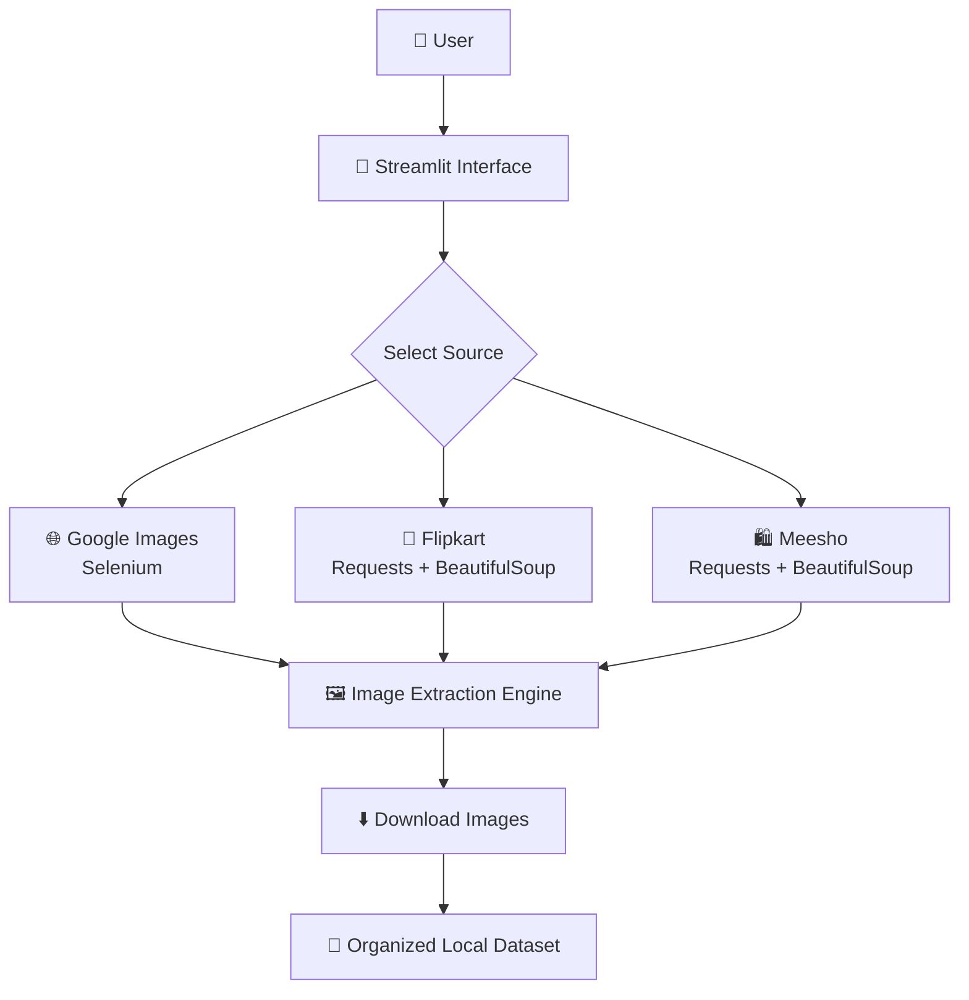

 <mark> <h1>📸 <i>Image Scraper — Automate  Image Collection</i></h1> </mark>

What if collecting hundreds of images from Google was as simple as typing a keyword and clicking a button?

**Image Scraper** is a Streamlit-based web app that automates image scraping from Google,Flipkart,meesho web app. Designed for developers, researchers, and creators who need fast access to visual data—without the manual grind.

---

## 🚀 Why I Built This

Manual image collection is slow, repetitive, and error-prone.  
Whether you're training a machine learning model, designing a UI, or building a dataset—this tool saves time and sanity by automating the entire process.
“Search. Scrape. Save. Simplified.”

---

## 🧠 What It Does

- 🔍 Accepts a search term via a clean web interface  
- 📡 Scrapes Google Images using BeautifulSoup + Requests + Selenium
- 📁 Saves all images into a structured local folder  
- 🧼 Built with Streamlit for smooth routing and input handling  
- 💡 Designed to be modular, scalable, and easy to extend

---

## 🛠️ Tech Stack

| Layer        | Tools Used                      |
|--------------|---------------------------------|
| Frontend     | Streamlit                       |
| Backend      | Python                          |
| Scraping     | BeautifulSoup,Requests,Selenium |
| Deployment   | Localhost (Prototype Phase)     |
|Browser Automation | ChromeDriver               |
---


## 🏗️ Project Architecture



## 📦 Installation

```bash
git clone https://github.com/sanskarhere/ImageHarvestor.git
cd ImageHarvestor
pip install -r requirements.txt
python app.py
